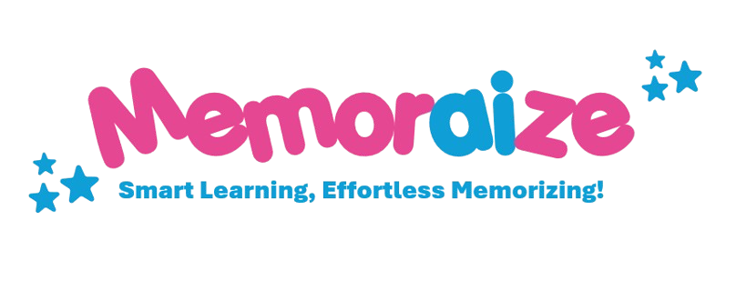

## MemorAIze 🧠



**MemorAIze** is a cutting-edge flashcard SaaS designed to enhance learning and memory retention through AI-powered features. Built with Next.js, Clerk, Firebase, Llama 3.1, and Stripe, MemorAIze offers users a smart and efficient way to create, manage, and learn from flashcards.

## What it does 🚀

- **AI-Powered Flashcard Generation**: Automatically generates flashcards based on user input, tailored to various difficulty levels and learning preferences.
- **Personalized Learning Experience**: Adapts to individual progress with dynamic difficulty adjustments and custom flashcard formats.
- **Multilingual Support**: Allows users to create and study flashcards in multiple languages, supporting global learning needs.
- **Time Efficiency**: Streamlines the flashcard creation process, saving users valuable time and effort.
- **Advanced Analytics**: Provides insights into learning progress and areas for improvement.

## How we built it 🛠️

- **Frontend**: Developed with Next.js for a modern, fast, and responsive user interface.
- **Backend**: Utilizes Firebase for real-time data synchronization and authentication.
- **AI Integration**: Powered by Llama 3.1 for intelligent content generation and adaptive learning features.
- **Payment Integration**: Stripe is used for secure subscription management and payment processing.
- **User Authentication**: Clerk provides secure and streamlined user authentication and management.

## Getting Started 📚

To get started with MemorAIze, clone the repository and install the required dependencies:

```bash
git clone git@github.com:I2S9/MemorAIze.git
cd MemorAIze
npm install
npm run dev
```

Configure the Llama API key in the `.env` file.

## Features 🌟

- **Intelligent Flashcard Creation**: Generate flashcards with the help of AI based on user-defined criteria.
- **Adaptive Learning Paths**: Automatically adjust flashcard difficulty based on user performance.
- **Multilingual Capabilities**: Create and review flashcards in multiple languages.
- **Customizable Formats**: Choose from various flashcard formats, including text, images, and audio (upcoming soon!)
- **Flashcards Sorting**: Sort your flashcards by name, date or thematic.